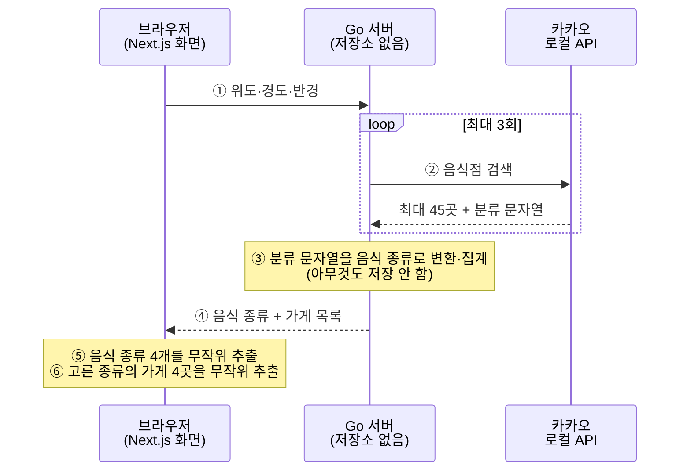

# 오늘 점심 뭐 먹지

점심에 무엇을 먹을지 대신 정해 주는 웹 서비스입니다.

위치만 허용하면 주변에 실제로 있는 음식점을 보고 **음식 종류**(한식·분식·돈까스 같은 것)를 네 개만 뽑아 보여줍니다. 그중에서도 못 고르면 버튼 하나로 하나를 정해 줍니다. 종류가 정해진 뒤에야 그 종류를 파는 주변 가게 목록을 보여줍니다.

핵심은 **"어디 갈지"보다 "뭘 먹을지"를 먼저 좁힌다**는 점입니다. 가게 이름 스무 개를 늘어놓으면 사람은 여전히 고르지 못합니다. "오늘은 돈까스"라고 한 단계만 정해 주면 나머지는 쉬워집니다.

## 화면 세 개

```
 ① 시작                    ② 후보 고르기              ③ 결과
┌──────────────────┐    ┌──────────────────┐    ┌──────────────────┐
│  오늘 점심,       │    │ 어느 쪽이 끌리나요?│    │   오늘은 → 돈까스 │
│  제가 정해 드릴게요│ →  │ ┌────┐┌────┐    │ →  │                  │
│                  │    │ │한식││분식│    │    │ 주변 돈까스집 4곳  │
│  [ 위치 허용하고  │    │ └────┘└────┘    │    │ · 연돈      120m │
│    시작하기 ]    │    │ ┌────┐┌────┐    │    │ · 홍대돈까스 240m │
│                  │    │ │돈까스││국밥│   │    │ · ...            │
│                  │    │ └────┘└────┘    │    │                  │
│                  │    │ [다시 뽑기]      │    │ [다른 가게 보기]  │
│                  │    │ [못 고르겠어 →]  │    │ [처음부터 다시]   │
└──────────────────┘    └──────────────────┘    └──────────────────┘
```

## 어떻게 동작하나



**무작위 추첨을 브라우저가 하는 이유**는 `다시 뽑기`와 `다른 가게 보기` 때문입니다. 서버에서 뽑으면 누를 때마다 카카오를 또 불러야 해서, 다섯 번 다시 뽑으면 호출이 열다섯 번 나갑니다. 한 번 받은 목록에서 뽑으면 즉시 끝나고 추가 호출이 없습니다. 종류를 뽑는 것도 가게를 뽑는 것도 같은 목록 위에서 일어나므로, 화면을 아무리 눌러도 조회는 처음 한 번뿐입니다.

**서버에 저장소가 없는 이유**는 카카오가 결과 저장을 금지하기 때문입니다. 카카오 담당자의 답변 원문은 "로컬API의 실시간 호출로만 이용 가능합니다(Live call only)"이며, 성능 개선 목적의 캐싱도 명시적으로 불허됩니다. 그래서 서버는 요청을 받으면 그 자리에서 카카오를 부르고, 가공해서 돌려주고, 아무것도 남기지 않습니다.

## 시작하기

### 1. 카카오 열쇠 받기

https://developers.kakao.com 에서 애플리케이션을 만들면 REST API 키가 발급됩니다.

```bash
echo 'KAKAO_REST_API_KEY=발급받은_키' > api/.env
```

`api/.env`는 무시 목록에 들어 있어 저장소에 올라가지 않습니다.

**열쇠가 없어도 개발과 시험은 전부 됩니다.** 서버는 정상적으로 뜨고, 조회 요청에만 "열쇠가 설정되지 않았습니다"라고 답합니다. 시험은 가짜 카카오 서버로 돌아가므로 열쇠도 네트워크도 필요 없습니다.

### 2. 서버 켜기 (터미널 두 개)

`just`가 설치되어 있다면 `just dev` 한 줄로 아래 두 서버를 한 번에 켤 수 있습니다(Ctrl+C 한 번이면 둘 다 꺼집니다). 아래는 그 안에서 실제로 하는 일입니다.

```bash
# 터미널 1 — Go 서버
cd api
export $(grep -v '^#' .env | xargs)   # 열쇠 읽기
go run ./cmd/server                    # 기본 8080 포트. PORT=8090 처럼 바꿀 수 있다

# 터미널 2 — 화면
cd web
npm install                            # 처음 한 번만
npm run dev                            # http://localhost:3000
```

8080이 아닌 포트로 Go 서버를 띄웠다면 화면 쪽에도 알려 줘야 합니다.

```bash
API_ORIGIN=http://localhost:8090 npm run dev
```

브라우저에서 http://localhost:3000 을 엽니다. 위치 권한을 물으면 허용하세요.

### 3. 잘 도는지 확인하기

`just check` 한 줄로도 됩니다. 아래는 그 안에서 실제로 도는 명령이고, 두 줄을 한 터미널에 그대로 붙여 넣어도 됩니다.

```bash
cd api && go test ./... && go vet ./...
cd ../web && npm run build && npm test && npx tsc --noEmit && npm run lint
```

두 가지가 순서에 걸립니다.

- 첫 줄이 `api`로 들어가므로 둘째 줄은 `web`이 아니라 `../web`이어야 합니다.
- `npm run build`가 `npx tsc --noEmit`보다 앞에 와야 합니다. `app/layout.tsx`가 쓰는
  `LayoutProps` 타입을 Next.js가 빌드하면서 만들어 주는데, 그 결과물은 저장소에
  올라가지 않습니다. 새로 내려받은 상태에서 타입 검사를 먼저 돌리면
  `Cannot find name 'LayoutProps'`로 실패합니다.

## 폴더 구조

```
api/                        Go 서버
├── cmd/server/             실행 진입점. 환경변수를 읽어 서버를 켠다
└── internal/
    ├── cuisine/            분류 문자열 → 음식 종류. 바깥과 닿지 않는 순수 계산
    ├── kakao/              카카오와 이야기하는 유일한 창구
    └── httpapi/            요청 값 검사, 응답 형태 만들기

web/                        Next.js 화면
├── app/page.tsx            세 화면 사이의 이동을 관리한다
├── components/             화면 조각 넷
├── app/error.tsx           화면을 그리다 실패했을 때 대신 보여 주는 안내
└── lib/
    ├── pick.ts             무작위 추첨 규칙 (난수 생성기를 밖에서 받는 순수 함수)
    ├── places.ts           결과 화면에 보여줄 가게 고르기 (뽑은 뒤 가까운 순으로)
    ├── api.ts              Go 서버 호출
    ├── geo.ts              브라우저에 현재 위치 묻기
    ├── errors.ts           오류 코드 → 화면 안내 문구
    └── radius.ts           결과가 없을 때 넓힐 반경 고르기

docs/superpowers/
├── specs/                  왜 이렇게 만들었는지 — 설계 판단과 그 근거
└── plans/                  어떻게 만들었는지 — 작업 단위와 검증 방법
```

## 지금 아는 한계

**"맛집"이 아니라 "주변 음식점"입니다.** 카카오 로컬 API는 평점도 리뷰 수도 주지 않습니다. 맛집인지 판단할 근거가 없어서, 정렬 기준은 가까운 순이고 화면 문구도 "맛집"이라고 쓰지 않습니다. 평점을 붙이려면 구글 Places를 함께 써야 하는데, 가게를 서로 짝지어야 하고 비용이 붙으며 구글은 결과를 지도에 표시할 때 반드시 구글 지도 위여야 한다는 제약이 있습니다. 별도 작업으로 남겨 두었습니다.

**음식 종류는 카카오 분류의 맨 앞 한 단계만 씁니다.** `음식점 > 한식 > 육류,고기 > 곱창,막창`도 `음식점 > 한식`도 똑같이 `한식`이 됩니다. 원래는 앞 두 단계(`한식 > 육류,고기`)까지 남기는 규칙이었는데, 2026-09-02 실측(강남역 부근 반경 500m)에서 `한식`과 `한식 > 육류,고기`가 같은 결과 안에 함께 나오는 게 확인됐습니다 — 두 단계 규칙에서는 이 둘이 서로 다른 카드로 갈라져 `한식`을 고른 사용자에게 고깃집이 보이지 않았습니다. 한 단계로 낮추면 이 문제는 없어지지만, 카드 하나에 여러 하위 종류(고기·국밥·두부전문점 등)가 섞여서 나옵니다.

**요청한 반경만큼 보지 못합니다.** 조회기는 가까운 순으로 45곳까지만 받아 옵니다. 카카오가 한 조회에 내어 주는 상한이 45곳이기 때문입니다(`pageable_count`). 사람이 많은 곳에서는 그 45곳이 요청한 반경을 한참 못 채웁니다 — 2026-09-06 실측에서 홍대입구역 반경 500m로 물었을 때 카카오는 그 안에 음식점이 900곳 있다고 답했지만, 우리가 받은 45곳 중 가장 먼 곳은 122m였습니다. 나머지 855곳은 보지도 못합니다.

그래서 **반경을 넓혀도 결과가 달라지지 않습니다.** 500m·1km·2km로 물어도 "가장 가까운 45곳"은 그대로라 받은 목록이 완전히 같았습니다. 반경을 넓히는 것은 주변에 음식점이 정말 드물어 45곳을 채우지 못할 때만 뜻이 있습니다.

**그래서 드문 음식 종류는 한두 곳만 남습니다.** 45곳을 종류별로 나누면 그렇게 됩니다. 같은 실측에서 음식 종류 열한 가지 중 여섯 가지가 이 상태였고, `샐러드`는 한 곳(샐러디 홍대입구역점)뿐이었습니다. 그런 종류를 고르면 `다른 가게 보기`를 눌러도 나올 가게가 없으므로 그 버튼을 두지 않고, 대신 몇 곳을 찾았는지 알립니다. 화면 문구가 "전부"라고 말하지 않는 것은 45곳 밖에 같은 종류가 더 있을 수 있기 때문입니다. 이것을 실제로 늘리려면 종류가 정해진 뒤 그 종류로 카카오를 한 번 더 부르는 방법을 써야 하는데, 조회 횟수가 늘고 카카오 키워드 검색은 분류가 다른 가게까지 섞어 주므로(실측에서 `샐러드`로 물으니 애슐리퀸즈·던킨 같은 곳이 함께 왔습니다) 별도 작업으로 남겨 두었습니다.

**아직 없는 것들**: 지도 표시, 여러 명이 함께 고르기, 최근에 먹은 것 제외, 로그인, 주소를 직접 입력해 위치 지정, 점심 외의 상황(저녁·카페). 요청 빈도 제한도 없어서, 공개 배포한다면 한 사람이 하루 호출 한도를 다 쓸 수 있습니다.
