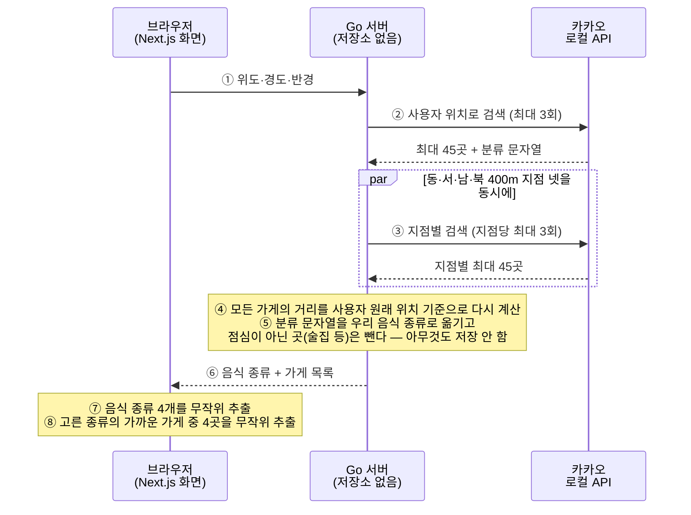

# 오늘 점심 뭐 먹지

점심에 무엇을 먹을지 대신 정해 주는 웹 서비스입니다.

위치만 허용하면 주변에 실제로 있는 음식점을 보고 **음식 종류**(`밥집·백반`, `분식`, `돈까스·우동` 같은 것)를 네 개만 뽑아 보여줍니다. 그중에서도 못 고르면 버튼 하나로 하나를 정해 줍니다. 종류가 정해진 뒤에야 그 종류를 파는 주변 가게 목록을 보여줍니다.

핵심은 **"어디 갈지"보다 "뭘 먹을지"를 먼저 좁힌다**는 점입니다. 가게 이름 스무 개를 늘어놓으면 사람은 여전히 고르지 못합니다. "오늘은 돈까스·우동"이라고 한 단계만 정해 주면 나머지는 쉬워집니다.

## 화면 네 개

```
 ① 시작
┌──────────────────────────────────────┐
│                                      │
│  오늘 점심, 제가 정해 드릴게요       │
│                                      │
│  [ 위치 허용하고 시작하기 ]          │
│  [ 최근 기록 보기 ]                  │
│                                      │
└──────────────────────────────────────┘
                   ↓
 ② 후보 고르기 — 음식 종류 넷
┌──────────────────────────────────────┐
│                                      │
│  어느 쪽이 끌리나요?                 │
│                                      │
│  ┌─────────────┐ ┌─────────────┐     │
│  │  밥집·백반  │ │    분식     │     │
│  │  주변 28곳  │ │  주변 19곳  │     │
│  └─────────────┘ └─────────────┘     │
│  ┌─────────────┐ ┌─────────────┐     │
│  │ 돈까스·우동 │ │   국밥·탕   │     │
│  │  주변 12곳  │ │  주변 15곳  │     │
│  └─────────────┘ └─────────────┘     │
│                                      │
│  [ 다시 뽑기 ]                       │
│  [ 못 고르겠어요, 정해 주세요 ]      │
│                                      │
└──────────────────────────────────────┘
                   ↓
 ③ 결과 — 고른 종류를 파는 가게
┌──────────────────────────────────────┐
│                                      │
│  지난번에 정하신 곳 1곳은 빼고       │
│  골랐어요           [ 다시 넣기 ]    │
│                                      │
│                오늘은                │
│             돈까스·우동              │
│                                      │
│  연돈                                │
│  120m · 도보 2분  [ 여기로 정했어요 ]│
│                                      │
│  홍대돈까스                          │
│  240m · 도보 4분  [ 여기로 정했어요 ]│
│                                      │
│  [ 다른 가게 보기 ]                  │
│  [ 처음부터 다시 ]                   │
│                                      │
└──────────────────────────────────────┘

   ④는 ① 시작 화면의 `최근 기록 보기`로 들어간다
 ④ 기록
┌──────────────────────────────────────┐
│                                      │
│  최근에 정하신 곳                    │
│                                      │
│  [ 최근에 정한 곳은 빼고 추천하기    │
│    아래 목록의 가게를 뺍니다  켜짐 ] │
│                                      │
│  연돈                    9월 4일     │
│                        [ 지우기 ]    │
│  봉된장                  9월 2일     │
│                        [ 지우기 ]    │
│                                      │
│  14일이 지난 기록은 저절로 사라져요  │
│                                      │
│  [ 전체 지우기 ]                     │
│  [ 돌아가기 ]                        │
│                                      │
└──────────────────────────────────────┘
```

결과 화면에는 이번에 세 가지가 늘었습니다. 가게 옆에 `240m · 도보 4분`처럼 걸어서 얼마나 걸리는지 나오고, `여기로 정했어요`를 누르면 그 가게가 브라우저에 기록되어 다음 조회부터 빠집니다. 지난번에 뺀 곳이 있으면 화면 맨 위에 `지난번에 정하신 곳 1곳은 빼고 골랐어요`라고 알립니다.

그 안내 옆의 `다시 넣기`는 이번 화면만 되돌리는 버튼이 아닙니다. **"최근에 정한 곳 빼기" 설정 자체를 끕니다.** 그래서 빠져 있던 가게가 다시 후보에 들어가 그 자리에서 목록이 새로 그려지고, 그 뒤로는 다음에 조회할 때도 아무것도 빠지지 않습니다. 끈 상태는 브라우저에 저장되어 다음 날에도 이어집니다. 대신 그 뒤로는 같은 자리가 `최근에 정한 곳 빼기가 꺼져 있어요`로 바뀌어 꺼져 있다는 것을 계속 알려 주고, 옆의 `다시 켜기`로 되돌릴 수 있습니다.

넷째 화면(기록)에서는 정한 곳을 한 곳씩 또는 전부 지울 수 있고(지운 직후에는 `되돌리기`가 뜹니다 — 그 화면을 벗어나면 사라집니다), 같은 스위치를 여기서도 껐다 켤 수 있습니다.

## 어떻게 동작하나



**무작위 추첨을 브라우저가 하는 이유**는 `다시 뽑기`와 `다른 가게 보기` 때문입니다. 서버에서 뽑으면 누를 때마다 카카오를 또 불러야 해서, 다섯 번 다시 뽑으면 호출이 열다섯 번 나갑니다. 한 번 받은 목록에서 뽑으면 즉시 끝나고 추가 호출이 없습니다. 종류를 뽑는 것도 가게를 뽑는 것도 같은 목록 위에서 일어나므로, 화면을 아무리 눌러도 조회는 처음 한 번뿐입니다.

**서버에 저장소가 없는 이유**는 카카오가 결과 저장을 금지하기 때문입니다. 카카오 담당자의 답변 원문은 "로컬API의 실시간 호출로만 이용 가능합니다(Live call only)"이며, 성능 개선 목적의 캐싱도 명시적으로 불허됩니다. 그래서 서버는 요청을 받으면 그 자리에서 카카오를 부르고, 가공해서 돌려주고, 아무것도 남기지 않습니다.

**다만 카카오에서 온 것 가운데 딱 세 가지가 브라우저에 남습니다.** 카카오는 조회 결과의 저장을 금지하지만, 담당자에게 직접 문의한 결과 예외가 하나 있습니다 — 사용자가 직접 찜하거나 코스에 담은 장소의 장소ID·상호는 "저장 범위에 허용됩니다"라는 답을 받았습니다. 그래서 결과 화면에서 `여기로 정했어요`를 누르면 그 가게의 장소ID·상호와 우리가 만든 날짜, 이 셋만 브라우저의 `localStorage`(`random-choice.visits.v1`, `web/lib/visits.ts`)에 남습니다. 조회 결과 목록 전체, 좌표, 거리, 카카오의 분류 문자열은 남기지 않습니다.

**`localStorage`에 남는 것이 하나 더 있습니다 — "최근에 정한 곳 빼기" 스위치를 껐는지 켰는지입니다**(`random-choice.avoid.v1`). 이것은 사용자가 만든 설정이지 카카오 응답에서 나온 값이 아니므로 위 저장 경계와는 무관합니다. 기록과 **다른 열쇠**에 따로 두는 것도 그래서입니다 — 기록을 `전체 지우기`로 지워도 이 설정은 남습니다. 지우는 대상은 다녀온 곳이지 사용자가 고른 설정이 아니기 때문입니다.

**음식 종류 식별자는 일부러 뺐습니다.** 우리 어휘의 식별자(`gogi`, `bapjip` 같은 값)는 카카오 분류 문자열을 계산해서 만든 값이라, 카카오가 금지한 "응답 데이터 원본 및 기반한 가공 데이터"에 해당한다고 읽힐 여지가 있습니다. 이것을 저장하면 "최근에 고른 종류는 다음엔 빼 준다"는 기능을 만들 수 있지만, 그 개입이 실제로 도움이 된다는 근거를 찾지 못했습니다. 위험은 있고 이득은 확인되지 않아 뺐습니다 — 카카오에서 답이 오고 그 개입을 원하는지 정하면 다시 볼 일입니다.

## 시작하기

### 1. 카카오 열쇠 받기

https://developers.kakao.com 에서 애플리케이션을 만들면 REST API 키가 발급됩니다.

```bash
echo 'KAKAO_REST_API_KEY=발급받은_키' > api/.env
```

`api/.env`는 무시 목록에 들어 있어 저장소에 올라가지 않습니다.

**열쇠가 없어도 개발과 시험은 전부 됩니다.** 서버는 정상적으로 뜨고, 조회 요청에만 "열쇠가 설정되지 않았습니다"라고 답합니다. 시험은 가짜 카카오 서버로 돌아가므로 열쇠도 네트워크도 필요 없습니다.

### 2. 서버 켜기 (터미널 두 개)

`just`가 설치되어 있다면 `just dev` 한 줄로 아래 두 서버를 한 번에 켤 수 있습니다(Ctrl+C 한 번이면 둘 다 꺼집니다). 아래는 그 안에서 실제로 하는 일입니다.

```bash
# 터미널 1 — Go 서버
cd api
export $(grep -v '^#' .env | xargs)   # 열쇠 읽기
go run ./cmd/server                    # 기본 8080 포트. PORT=8090 처럼 바꿀 수 있다

# 터미널 2 — 화면
cd web
npm install                            # 처음 한 번만
npm run dev                            # http://localhost:3000
```

8080이 아닌 포트로 Go 서버를 띄웠다면 화면 쪽에도 알려 줘야 합니다.

```bash
API_ORIGIN=http://localhost:8090 npm run dev
```

브라우저에서 http://localhost:3000 을 엽니다. 위치 권한을 물으면 허용하세요.

### 3. 잘 도는지 확인하기

`just check` 한 줄로도 됩니다. 아래는 그 안에서 실제로 도는 명령이고, 두 줄을 한 터미널에 그대로 붙여 넣어도 됩니다.

```bash
cd api && go test ./... && go vet ./...
cd ../web && npm run build && npm test && npx tsc --noEmit && npm run lint
```

두 가지가 순서에 걸립니다.

- 첫 줄이 `api`로 들어가므로 둘째 줄은 `web`이 아니라 `../web`이어야 합니다.
- `npm run build`가 `npx tsc --noEmit`보다 앞에 와야 합니다. `app/layout.tsx`가 쓰는
  `LayoutProps` 타입을 Next.js가 빌드하면서 만들어 주는데, 그 결과물은 저장소에
  올라가지 않습니다. 새로 내려받은 상태에서 타입 검사를 먼저 돌리면
  `Cannot find name 'LayoutProps'`로 실패합니다.

## 올려 둔 곳

| | 주소 | Vercel 프로젝트 |
|---|---|---|
| 화면 | https://random-choice-gamma.vercel.app | `random-choice` |
| 서버 | https://api-beryl-chi-94.vercel.app | `api` |

둘 다 서울에서 돕니다. 이 서버는 요청마다 카카오를 실시간으로 부르는데(응답을 저장하는
것이 금지되어 미리 담아 둘 수 없습니다) 기본값인 미국에 두면 태평양 왕복이 사용자
대기에 그대로 더해집니다. 지역은 각 폴더의 `vercel.json`이 정합니다.

Go 서버는 도커 파일 없이 Vercel의 Go 방식으로 그대로 올라갑니다. 빌드할 때 Go 1.26을
내려받아 씁니다.

### 다시 올릴 때

**push해도 자동으로 배포되지 않습니다.** GitHub Actions를 쓰지 않습니다 — Vercel
계정에 GitHub 로그인 연결이 없어서 저장소와 이어 두지 못했습니다. 그래서 `just deploy`
한 줄로 손으로 올립니다.

```bash
just deploy
```

커밋 전 전체 검증(`just check`)을 먼저 돌리고, 통과해야 서버 → 화면 순서로 올립니다.
아래는 그 안에서 실제로 도는 명령입니다.

```bash
cd api && vercel deploy --prod --yes --archive=tgz    # 서버를 고쳤을 때
cd web && vercel deploy --prod --yes --archive=tgz    # 화면을 고쳤을 때
```

한쪽만 다시 올리려면 `just deploy-api` 또는 `just deploy-web`을 씁니다(둘 다 검증을
건너뜁니다 — 검증까지 원하면 `just check`를 먼저 따로 부르세요).

**서버가 먼저인 이유.** 화면은 `API_ORIGIN`이 가리키는 주소로 조회를 넘기는데, 이 값을
브라우저의 요청이 올 때마다 읽습니다(`web/app/api/v1/nearby/route.ts`) — 예전처럼
빌드에 굳지 않습니다. 화면을 먼저 올리면 그사이 화면이 아직 없는 서버를 가리키는 순간이
생기는데, 서버를 먼저 두면 그 틈이 없습니다.

### 환경변수 — 두 프로젝트에 네 자리

| 어디 | 이름 | 무엇 |
|---|---|---|
| `api` 프로젝트 | `KAKAO_REST_API_KEY` | 카카오 열쇠. Secret이라 대시보드에서도 값이 안 보입니다 |
| `api` 프로젝트 | `INTERNAL_API_KEY` | 화면 서버에서 온 조회만 받아들이게 하는 비밀값 |
| `random-choice` 프로젝트 | `API_ORIGIN` | 위 서버 주소. 없으면 배포본의 모든 조회가 실패합니다 |
| `random-choice` 프로젝트 | `INTERNAL_API_KEY` | 바로 위 `api` 쪽과 **똑같은 값** |

**`INTERNAL_API_KEY`를 왜 두는가.** 서버 주소는 인터넷에 열려 있고, 조회 한 번이 카카오를
최대 열다섯 번 부릅니다. 하루 한도가 10만 건이니 6,600번쯤이면 그날치가 소진되고, 그때부터는
정상 사용자도 전부 실패합니다. 그래서 서버가 `X-Internal-Key` 헤더를 요구하고, 그 헤더는
브라우저가 아니라 **화면 서버가** 붙입니다(중계가 서버 쪽에서 일어나므로 개발자 도구에
보이지 않습니다). `/healthz`와 `/readyz`는 그대로 열어 둡니다 — 감시 도구가 닿아야 하고
둘 다 카카오를 부르지 않습니다.

값은 아무 무작위 문자열이면 되고 `openssl rand -hex 24`로 만들면 됩니다.
**영문·숫자만 쓰세요** — HTTP 헤더 값에 한글을 넣으면 화면 서버가 요청을 보내지 못합니다.
**앞뒤에 공백이 딸려 들어가지 않게 하세요.** 붙여 넣다 공백이 섞이면, 헤더로 오가는 동안
그 공백이 잘려 나가 서버가 가진 값과 영영 어긋납니다. 그러면 모든 조회가 401이 되고
화면은 "두 서버가 나눠 갖는 값이 서로 맞지 않는다"까지는 알려 줍니다. 다만 **왜 어긋났는지**는
아무 데도 나오지 않습니다 — 두 값이 눈으로 보기에 똑같기 때문입니다.
두 프로젝트의 값이 어긋나면 모든 조회가 401(`unauthorized`)로 막힙니다. 화면 쪽에만 넣고
`api` 쪽에 넣지 않으면 조회 주소가 예전처럼 인터넷에 열린 채로 남습니다
(그때는 서버가 뜰 때 경고를 남깁니다).
**로컬 개발에는 넣지 않아도 됩니다** — 값이 비어 있으면 검사하지 않습니다.

**이것으로 한도 문제가 끝나지는 않습니다.** 닫힌 것은 "우리 화면을 거치지 않는 경로"
하나입니다.

```
[전]  누구든 ─────────────────────────▶ 서버 ─▶ 카카오 15회
[후]  누구든 ─▶ 화면 주소의 /api/v1/nearby
                     └─비밀값을 붙여──▶ 서버 ─▶ 카카오 15회
```

화면 주소의 `/api/v1/nearby`는 여전히 아무나 부를 수 있고, 한 번이 카카오를 최대 15번
씁니다. **한도를 소진시키는 데 필요한 요청 수는 약 6,600번으로 변하지 않았습니다.**
그 길까지 막으려면 같은 곳에서 오는 요청의 빈도를 제한해야 하고, 그것은 아직 없습니다.

그래도 이 변경에는 값이 있습니다. 서버 주소를 아는 사람이 우리 화면을 거치지 않고
바로 두드리는 것 — 실제로 curl 한 줄로 되던 것 — 은 이제 막힙니다.

**이 값들은 실서비스(Production)에만 넣습니다.** 미리보기 배포는 별도 자원을 받지 않아,
미리보기에도 열쇠를 넣으면 시험할 때마다 실서비스의 카카오 하루 한도를 함께 깎습니다.

**그래서 지금 미리보기에서는 조회가 되지 않습니다.** 미리보기에는 `API_ORIGIN`이 없어
화면 서버가 `http://localhost:8080`으로 요청을 보내는데, Vercel 함수 안에는 거기 듣는
것이 없어 중계가 조회 서버에 닿지 못합니다. 화면에는 "조회 서버에 닿지 못했어요"라는
안내가 뜹니다 — 중계가 그 실패를 502와 오류 코드(`api_unreachable`)로 바꿔 주기
때문입니다(조회 서버가 없는 주소를 가리켜 로컬에서 확인했습니다).

그 전에는 같은 상황이 **본문 없는 HTTP 500**으로 끝났고(미리보기를 올려 실측한 값입니다),
화면은 그 500에서 오류 코드를 읽지 못해 안내 문구조차 고르지 못했습니다. 이 저장소의
지금 코드가 배포되기 전까지 미리보기는 여전히 그 500을 돌려줍니다.

미리보기에서도 조회를 시험하려면 `API_ORIGIN`과 `INTERNAL_API_KEY`를 미리보기 환경에도
넣어야 하고, 그러면 위에 적은 대로 실서비스의 카카오 한도를 함께 쓰게 됩니다.
화면만 보는 것(글자·배치·이동)은 지금 상태로도 됩니다.

## 폴더 구조

```
api/                        Go 서버
├── cmd/server/             실행 진입점. 환경변수를 읽어 서버를 켠다
├── internal/
    ├── cuisine/            카카오 분류 문자열 → 우리 음식 종류 열여덟 가지. 바깥과 닿지 않는 순수 계산
    ├── geo/                두 좌표 사이 거리, 한 좌표에서 동서남북으로 옮긴 좌표. 바깥과 닿지 않는 순수 계산
    ├── kakao/              카카오와 이야기하는 유일한 창구. 다섯 지점을 조회해 합치고 거리를 다시 계산한다
    └── httpapi/            요청 값 검사, 응답 형태 만들기
└── vercel.json             배포할 때 실행 지역을 서울로 지정

web/                        Next.js 화면
├── app/page.tsx            네 화면 사이의 이동을 관리한다
├── app/api/v1/nearby/route.ts  브라우저의 조회를 Go 서버로 넘기는 자리 (환경변수만 읽는 껍데기)
├── components/
│   ├── StartScreen.tsx     시작 화면
│   ├── CandidateScreen.tsx 후보 고르기 화면
│   ├── ResultScreen.tsx    결과 화면 — 도보 시간, "여기로 정했어요", 회피 안내 줄
│   ├── VisitsScreen.tsx    기록 화면 — 정한 곳 목록, 지우기, 회피 스위치
│   └── Notice.tsx          빈 결과·오류 화면에 쓰는 안내 조각
├── app/error.tsx           화면을 그리다 실패했을 때 대신 보여 주는 안내
├── lib/
    ├── pick.ts             무작위 추첨 규칙 (난수 생성기를 밖에서 받는 순수 함수)
    ├── places.ts           결과 화면에 보여줄 가게 고르기 (가까운 창 안에서 뽑고 거리순으로)
    ├── cuisines.ts         같은 음식 종류가 겹치면 하나만 남기기
    ├── visits.ts           "여기로 정했어요" 기록의 저장·조회·삭제 (저장소를 밖에서 받는다)
    ├── avoid.ts            기록을 근거로 가게를 걸러내고, 몇 곳을 걸렀는지 함께 돌려주기
    ├── reasons.ts          후보·결과에 붙일 한 줄 이유 (거리, 도보 시간, 곳 수, 회피 안내)
    ├── api.ts              Go 서버 호출
    ├── proxy.ts            중계 규칙 — 비밀 헤더 붙이기, 응답을 그대로 넘기기, 캐시 금지 지키기
    ├── geo.ts              브라우저에 현재 위치 묻기
    ├── errors.ts           오류 코드 → 화면 안내 문구
    └── radius.ts           결과가 없을 때 넓힐 반경 고르기
└── vercel.json             배포할 때 실행 지역을 서울로 지정

docs/superpowers/
├── specs/                  왜 이렇게 만들었는지 — 설계 판단과 그 근거
└── plans/                  어떻게 만들었는지 — 작업 단위와 검증 방법
```

## 지금 아는 한계

**"맛집"이 아니라 "주변 음식점"입니다.** 카카오 로컬 API는 평점도 리뷰 수도 주지 않습니다. 맛집인지 판단할 근거가 없어서, 정렬 기준은 가까운 순이고 화면 문구도 "맛집"이라고 쓰지 않습니다. 평점을 붙이려면 구글 Places를 함께 써야 하는데, 가게를 서로 짝지어야 하고 비용이 붙으며 구글은 결과를 지도에 표시할 때 반드시 구글 지도 위여야 한다는 제약이 있습니다. 별도 작업으로 남겨 두었습니다.

**음식 종류는 카카오 분류가 아니라 우리가 정한 열여덟 가지 어휘로 나눕니다.** `음식점 > 한식 > 육류,고기`는 `고기·구이`로, 하위 분류가 없는 `음식점 > 한식`은 `밥집·백반`으로 옮기는 식입니다(규칙 전체는 `api/internal/cuisine/cuisine.go`에 있습니다). 예전에는 카카오 분류의 맨 앞 한 단계만 그대로 썼는데, 그러면 `한식` 카드 하나에 고깃집·국밥집·냉면집·횟집이 다 몰렸습니다 — 2026-09-06 실측(상계역)에서 `한식` 한 장이 주변 225곳 중 106곳(47%)을 차지했습니다. 자체 어휘로 세분화하면서 이 뭉침은 없어졌습니다. 같은 실측에서 규칙에 걸리지 않아 버린 가게는 664곳 중 3곳(0.5%)뿐이었고, 이 수가 늘어나면 서버 로그가 "맞는 규칙 없음"으로 따로 알립니다 — 우리 어휘에 구멍이 생겼다는 뜻이기 때문입니다.

**점심이 아닌 곳은 뺍니다.** 카카오의 "음식점" 분류에는 술집이 들어 있어서, 그대로 두면 점심시간에 위스키바를 권하게 됩니다. 같은 실측에서 강남역 31곳(14%)이 술집이었습니다. 판정 기준은 "이것만 먹고 점심을 때울 수 있는가" 하나이고, 빵집·토스트는 남기지만 아이스크림 한 통이나 도넛은 남기지 않습니다.

**한 지점에서는 여전히 가까운 45곳까지만 봅니다.** 카카오가 한 조회에 내어 주는 상한이 45곳이기 때문입니다(`pageable_count`). 사람이 많은 곳에서는 이 45곳이 반경을 한참 못 채웁니다 — 2026-09-06 실측에서 홍대입구역 반경 500m로 물었을 때 카카오는 그 안에 음식점이 900곳 있다고 답했지만, 한 지점에서 받은 45곳 중 가장 먼 곳은 110m였습니다(이 수치의 출처는 설계 문서 `docs/superpowers/specs/2026-09-06-lunch-upgrade-design.md` 4-3절 표입니다). 나머지 855곳은 보지도 못합니다.

**그래서 이제는 사용자 위치와 그 동서남북 400m 지점, 합해서 다섯 지점을 함께 봅니다.** 지점마다 최대 45곳이라 최대 225곳까지 모입니다(`api/internal/kakao/client.go`의 `SearchAround`). 2026-09-06 실측(네 지역)에서 다섯 지점의 결과가 하나도 겹치지 않았고, 45곳이 약 220곳으로 늘었습니다 — 한 지점이 실제로 보는 범위가 반경 100~160m뿐이라 400m 떨어진 지점과 만날 수 없기 때문입니다. 가게가 어느 지점에서 왔든 화면에 보이는 거리는 카카오가 준 값이 아니라 사용자의 원래 위치를 기준으로 다시 계산한 값입니다(`api/internal/geo/`) — 옮긴 지점 기준 거리를 그대로 쓰면 412m가 24m로 보이는 것을 실측으로 확인했기 때문입니다.

**그래도 반경을 넓히는 것 자체는 여전히 결과를 바꾸지 못합니다.** 각 지점은 그 지점 기준으로 "가장 가까운 45곳"을 받아 오므로, 500m·1km·2km 어느 쪽으로 물어도 지점마다 받는 45곳은 똑같습니다. 반경을 넓히는 것은 애초에 45곳을 못 채울 만큼 음식점이 드물 때만 뜻이 있습니다. 다만 이제는 **요청한 반경보다 최대 400m 먼 가게가 결과에 섞일 수 있습니다** — 동서남북 지점이 사용자 위치에서 400m 떨어져 있고 그 지점에서도 요청 반경만큼 더 찾기 때문입니다. 예를 들어 기본 반경 500m로 찾으면 사용자에게서 최대 900m 떨어진 가게가 나올 수 있습니다.

**드문 음식 종류는 여전히 한 곳만 남을 수 있습니다.** 한 지점만 보던 예전에는 45곳을 종류별로 나누면 카드의 43%가 가게 한 곳뿐이었습니다. 다섯 지점을 함께 보면 이 비율이 6%로 떨어집니다(2026-09-06 강남역 실측 — 술집·군것질을 뺀 188곳을 18개 카드로 나눈 결과). 그런 카드를 고르면 `다른 가게 보기`를 눌러도 나올 가게가 없으므로 그 버튼을 두지 않고, 대신 몇 곳을 찾았는지 알립니다. 화면 문구가 "전부"라고 말하지 않는 것은 45곳 밖에 같은 종류가 더 있을 수 있기 때문입니다.

**음식점이 드문 곳에서는 다섯 지점을 봐도 소용없습니다.** 제주 애월 해안에서 다섯 지점을 조회하니 술집·군것질을 뺀 점심 대상이 17곳뿐이었습니다. 카드 6장 중 3장이 가게 한 곳뿐이었고, 70%가 500m를 넘었으며 가장 먼 곳은 867m였습니다. 반경이나 창을 넓혀도 달라지지 않습니다 — 그보다 가까운 가게가 애초에 그 동네에 없기 때문입니다. 할 수 있는 것은 거리와 도보 시간을 정직하게 보여주는 것뿐입니다.

**기록은 이 브라우저에만 있습니다.** `localStorage`에 저장하므로 다른 브라우저나 시크릿(사생활 보호) 창을 열면 기록이 없습니다. 로그인이 없어서 기기 사이에 맞출 방법도 없습니다.

**음식 종류를 회피하는 기능은 없습니다.** "최근에 고른 종류는 다음엔 빼 준다"는 만들지 않았습니다. 이유가 둘입니다 — 그 개입이 실제로 만족도를 올린다는 근거를 찾지 못했고, 종류 식별자를 저장하는 것 자체가 카카오 약관 해석에서 갈립니다(위 "어떻게 동작하나"의 저장 범위 설명 참고). 위험은 있고 이득은 확인되지 않아 뺐습니다.

**계측이 없어서 지금 정한 수를 데이터로 고칠 수 없습니다.** 기록 보관 기간(14일)도, 후보로 보여주는 종류 수(넷)도, 회피가 실제로 도움이 되는지도 전부 근거 없이 정한 값입니다. 서버 저장소도 로그인도 없어서 "2주가 맞는지" 같은 질문에 답할 사용 데이터 자체가 쌓이지 않습니다.

**아직 없는 것들**: 지도 표시, 여러 명이 함께 고르기, 로그인, 주소를 직접 입력해 위치 지정, 점심 외의 상황(저녁·카페). 요청 빈도 제한도 없어서, 조회 한 건이 이제 카카오 호출을 최대 15번(다섯 지점 × 최대 3페이지) 쓰는데도 공개 배포한다면 한 사람이 하루 호출 한도(10만 건, 최대치 기준 하루 약 6,600명분)를 다 쓸 수 있습니다.
